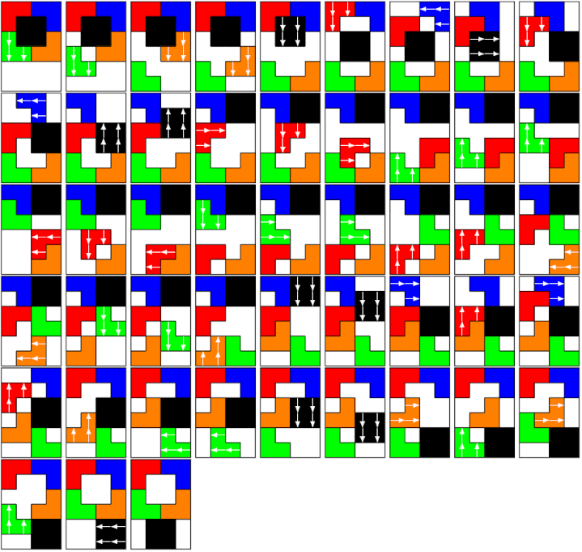

# Klotski
A tool to slove any sliding puzzle
 

## Usage
- Install OCaml and LaTeX
- Compile the OCaml part using **make**
- Define the start and end configuration of the puzzle in *start.txt* and *end.txt*
- Run **make mode** with one of the modes described below to obtain a *pdf* file containing a description of an eventual shortest solution, or an error if there is none.

## Designing a puzzle
A puzzle piece is defined by a letter. The current example corresponds to the above picture. The size of the puzzle is arbitrary. The text files must end with an empty line.

## Special characters
To design a puzzle, keep in mind that underscores **_** represent empty slots, and **.** are obstacles that cannot move. All other letters and characters can be used to define pieces.

## Modes 
There are three modes: classical, labyrinth and shape. The first, obtained with **make run** is for puzzles in which the first and last configuration are imposed. The second, obtained with **make lab** is when only the piece labeled with **X** has a specified target position. The third, obtained with **make shape** tries to slide the pieces described in *start.txt* into all non-empty slots of *end.txt*. This mode is used for puzzles that focus on transforming shapes.